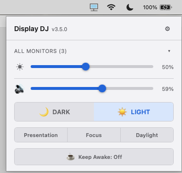
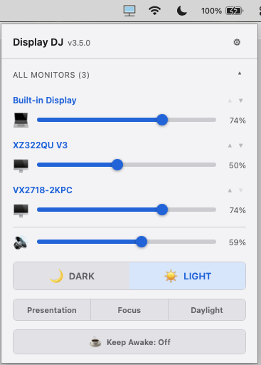
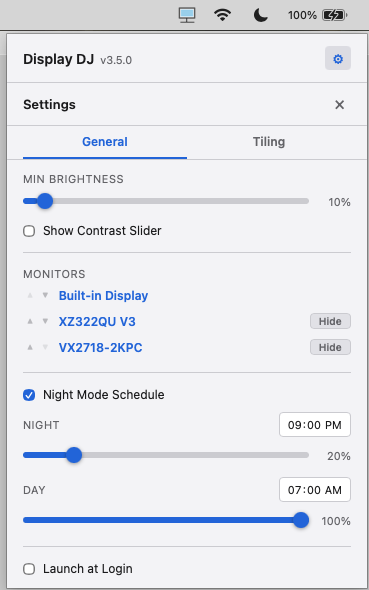
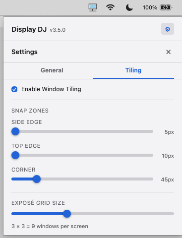
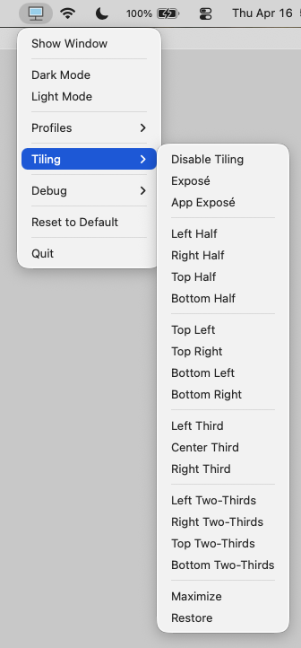
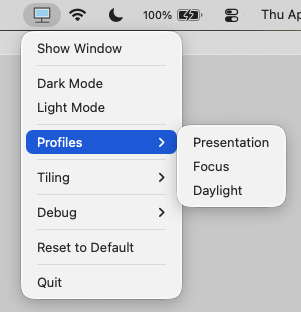
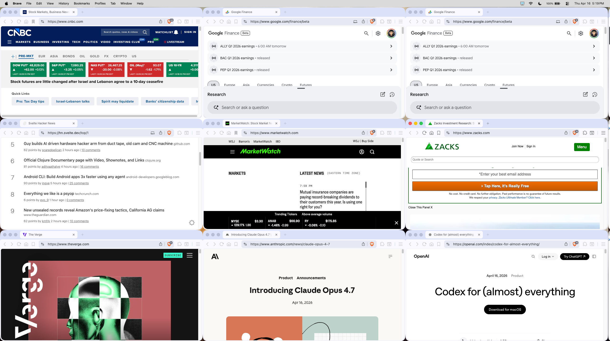

[](https://github.com/synle/display-dj/actions/workflows/build.yml)

# Display DJ

A cross-platform desktop system tray app for controlling monitor brightness, contrast, dark mode, volume, keep-awake, window tiling, exposé, and layout presets -- all from one place. Works with both built-in laptop displays and external monitors via DDC/CI. Supports **macOS**, **Windows**, and **Linux**.

## Why I Built This

- **No built-in external display control** -- macOS, Windows, and Linux have no native way to adjust brightness or contrast on external monitors connected via HDMI, USB-C, or DisplayPort. You're stuck reaching for physical buttons on the back of your monitor.
- **Fragmented experience** -- every OS handles brightness, dark mode, and volume differently with different UIs, scattered across different system panels. There's no single place to control it all.
- **Unified keyboard shortcuts** -- I wanted one set of global hotkeys that works the same way everywhere, regardless of which app is focused or which OS I'm on.
- **Too many single-purpose apps** -- instead of installing separate apps for brightness control, volume control, keep awake, window tiling, and exposé, Display DJ bundles all of that into one lightweight tray app.
- **Small and fast** -- built with Rust and Tauri instead of Electron/Node.js. The entire app is a fraction of the size and memory footprint of an Electron app, while still using a modern React frontend.

## Screenshots

|                 Main View (All Monitors)                  |                         Main View (Individual)                          |
| :-------------------------------------------------------: | :---------------------------------------------------------------------: |
|  |  |

|                  Settings - General                   |                  Settings - Tiling                  |
| :---------------------------------------------------: | :-------------------------------------------------: |
|  |  |

|                  Tray Menu - Tiling                   |                   Tray Menu - Profiles                    |
| :---------------------------------------------------: | :-------------------------------------------------------: |
|  |  |

| Exposé Grid (all windows across 3 monitors) |
| :-----------------------------------------: |
|  |

## Features

- **Brightness control** -- a single slider to adjust all monitors at once, or expand to control each monitor individually
- **Contrast control** -- DDC/CI contrast adjustment for external monitors (enable in Settings)
- **Dark mode toggle** -- system-wide dark/light mode switch
- **Volume control** -- system volume slider with mute indicator
- **Keep Awake** -- prevent your system from sleeping with a single toggle (macOS, Windows, Linux)
- **Night mode schedule** -- automatically set brightness and dark/light mode on a time-based schedule (e.g., dim at 9 PM, bright at 7 AM). Supports custom commands (`nightCommands`/`dayCommands`) to run arbitrary actions on schedule (volume changes, profile activation, per-monitor brightness)
- **Profiles** -- save and restore preset combinations of brightness, contrast, dark mode, and volume
- **Global keyboard shortcuts** -- work even when the app isn't focused; fully configurable
- **Monitor renaming** -- click any display name to give it a custom label
- **Window tiling** (macOS + Windows + Linux/X11) -- tile windows to halves, thirds, two-thirds, quarters, or maximize via keyboard shortcuts or tray menu
- **Tile Snap** (macOS only) -- drag a window to a screen edge to preview and snap it into a tiled layout. Enable/disable via the Tile Snap toggle in Settings
- **Exposé** (macOS + Windows + Linux/X11) -- spread all windows into a grid overview, or just the current app's windows. Deterministic alphabetical layout with configurable multi-display strategy (spread evenly or fill each display). Has its own tray submenu with enable/disable toggle and grid size presets (2x2 through 5x5)
- **App Exposé** -- grids the frontmost app's windows and fills remaining grid cells with other apps' windows
- **Layout Presets** -- named presets that automatically tile specific apps to specific layouts. Triggered via keyboard shortcuts, profiles, or the tray menu
- **Dynamic tray icon** -- the system tray icon updates to reflect app state: dark/light mode (border color), keep-awake active (blue fill), and muted (red X overlay)
- **Settings panel** -- tabbed UI (General + Tiling) with auto-save. Configure brightness, contrast, monitors, night mode, snap zones, exposé grid size, layout strategy, and launch at login
- **About / Update check** -- "About Display DJ" in the tray menu shows current version, latest GitHub release, engine, platform, build date, and homepage. Green "Up to date" or orange "Update available" badge with download link. macOS section includes quarantine fix and Accessibility settings commands
- **System tray app** -- lives in your menu bar / system tray with no dock or taskbar clutter

## Download & Install

Grab the latest release from the **[Releases](../../releases)** page.

### macOS

| Chip          | File                           |
| ------------- | ------------------------------ |
| Apple Silicon | `Display DJ_x.x.x_aarch64.dmg` |
| Intel         | `Display DJ_x.x.x_x64.dmg`     |

1. Download the `.dmg` for your chip
2. Open the `.dmg` and drag **Display DJ** into your **Applications** folder
3. Launch **Display DJ** from Applications -- it will appear in your **menu bar** (top-right)

> **First launch note:** macOS Gatekeeper may show _"Display DJ is damaged and can't be opened"_ or _"unidentified developer"_ because the app is not notarized via the App Store. See the [macOS Gatekeeper fix](#macos-gatekeeper-fix) below.

### Windows

| Architecture | File                             |
| ------------ | -------------------------------- |
| x64          | `Display DJ_x.x.x_x64-setup.exe` |

1. Download the `.exe` installer
2. Run the installer and follow the prompts
3. Launch **Display DJ** -- it will appear in your **system tray** (bottom-right; click `^` if hidden)

### Linux

| Format   | File                              |
| -------- | --------------------------------- |
| Debian   | `Display DJ_x.x.x_amd64.deb`      |
| AppImage | `Display DJ_x.x.x_amd64.AppImage` |

1. Install via your preferred format:

   ```bash
   # Debian / Ubuntu
   sudo dpkg -i "Display DJ_x.x.x_amd64.deb"

   # AppImage (no install needed)
   chmod +x "Display DJ_x.x.x_amd64.AppImage"
   ./"Display DJ_x.x.x_amd64.AppImage"
   ```

2. Install the required display-control dependencies:
   ```bash
   sudo apt install ddcutil brightnessctl i2c-tools
   sudo modprobe i2c-dev
   sudo usermod -aG i2c $USER
   ```
3. The app appears in your **top panel** (you may need the [AppIndicator extension](https://extensions.gnome.org/extension/615/appindicator-support/) on GNOME)

## Configuration

Config files are stored in:

- **macOS**: `~/Library/Application Support/display-dj/`
- **Windows**: `%APPDATA%\display-dj\`
- **Linux**: `~/.config/display-dj/`

The main config file is **`preferences.json`** -- it holds keyboard shortcuts, min brightness, night mode schedule, profiles, and per-monitor metadata (labels, sort order).

### Default Keyboard Shortcuts

| Keys            | Action                       |
| --------------- | ---------------------------- |
| Shift + Escape  | Toggle Dark Mode             |
| Shift + F1      | Brightness 10% + Dark Mode   |
| Shift + F2      | Brightness 100% + Light Mode |
| Shift + F3-F5   | Brightness 0% / 50% / 100%   |
| Shift + F10-F12 | Volume 0% / 10% / 100%       |

**Window Tiling** (macOS + Windows + Linux/X11):

| Keys                  | Action                           |
| --------------------- | -------------------------------- |
| Ctrl + Shift + Left   | Left Third                       |
| Ctrl + Shift + Right  | Right Third                      |
| Ctrl + Shift + Up     | Left Two-Thirds                  |
| Ctrl + Shift + Down   | Right Two-Thirds                 |
| Ctrl + Shift + D/C/G  | Left/Center/Right Third          |
| Ctrl + Shift + I/O    | Top-Left/Top-Right Quarter       |
| Ctrl + Shift + K/L    | Bottom-Left/Bottom-Right Quarter |
| Ctrl + Shift + M or / | Maximize                         |
| Ctrl + Shift + E      | Exposé (all windows)             |
| Ctrl + Up             | Exposé (all windows)             |
| Ctrl + Shift + A      | App Exposé (current app only)    |
| Ctrl + Down           | App Exposé (current app only)    |

## Window Tiling (macOS + Windows + Linux/X11)

Window tiling lets you snap windows to halves, thirds, two-thirds, quarters, or maximize using keyboard shortcuts or the **Tiling** submenu in the tray icon's right-click menu. All 19 layouts, restore, Exposé, and App Exposé work on macOS, Windows, and Linux (X11). Tile Snap (mouse edge snapping) is currently macOS-only.

### Exposé

Two Exposé modes are available:

- **Exposé** (Ctrl+Up or Ctrl+Shift+E) -- spreads all on-screen windows into a deterministic alphabetical grid. Fills the first display, then overflows to the next. Windows with minimum size constraints (e.g., Steam, Chrome) that don't fit in the grid automatically overflow to subsequent displays where cells are larger.
- **App Exposé** (Ctrl+Down or Ctrl+Shift+A) -- grids the frontmost app's windows, then fills remaining grid cells with other apps' windows.

Both modes normalize windows first (unminimize and exit fullscreen), then lay out a grid. Each invocation always re-lays out all windows (no toggle/restore). The grid size is configurable in Settings (Tiling tab) with separate Columns and Rows sliders (1-5 each, default 3x3). The layout strategy can be set to "spread" (distribute windows evenly across all displays) or "fill" (pack each display to capacity before using the next).

The Exposé tray submenu (separate from Tiling) provides an Enable/Disable toggle, Exposé and App Exposé actions, and grid size presets (2x2, 2x3, 3x3, 3x4, 4x4, 5x5).

### Layout Presets

Layout presets let you define named configurations that automatically tile specific apps to specific layouts. Each preset has a `name` and a list of `rules`. Each rule specifies:

- `appMatch` -- case-insensitive substring to match against window/app names
- `layout` -- the tiling layout to apply (e.g., `"leftHalf"`, `"rightThird"`, `"maximize"`)
- `displayIndex` (optional) -- 0-based display index to place the window on

Presets are triggered via `command/layout/{name_or_index}` and can be bound to keyboard shortcuts, included in profiles, or triggered from the "Layout Presets" tray submenu. Configure presets by editing `preferences.json` (accessible via "Open App Preferences" in the tray menu) or browse the config directory via "Open App Folder".

## Wallpaper

Display DJ can change your desktop wallpaper via commands that work from keyboard shortcuts, profiles, and night/day schedules.

### Setting a Wallpaper

Use the `command/wallpaper/change/{path}` command in your keyboard shortcuts or profiles. The path must be an absolute path to an image file.

**macOS:**

```json
"command/wallpaper/change//Users/jane/Pictures/mountain.jpg"
```

**Windows:**

```json
"command/wallpaper/change/D:\\Pictures\\mountain.jpg"
"command/wallpaper/change/C:\\Users\\YourName\\Pictures\\wallpaper.png"
```

Windows network shares (UNC paths) also work:

```json
"command/wallpaper/change/\\\\NAS-SERVER\\g\\share\\Wallpapers\\sunset.jpg"
```

> **Note:** In JSON, backslashes must be doubled (`\\`). The path `\\NAS-SERVER\g\share\Wallpapers\sunset.jpg` becomes `\\\\NAS-SERVER\\g\\share\\Wallpapers\\sunset.jpg` in `preferences.json`.

**Fit modes:** Add a fit mode before the path to control how the image fills the screen: `fill` (default), `fit`, `stretch`, `center`, `tile`.

```json
"command/wallpaper/change/fit/D:\\Pictures\\wide-banner.jpg"
```

**Per-monitor wallpaper** (macOS + Windows only):

```json
"command/wallpaper/change_single/Dell U2723QE/D:\\Pictures\\left-monitor.jpg"
"command/wallpaper/change_single/builtin/fill//Users/jane/Pictures/laptop.jpg"
```

The monitor name is matched by case-insensitive substring (e.g., `"Dell"` matches `"Dell U2723QE"`).

### Slideshow

Start a slideshow that cycles through all images in a folder:

```json
"command/wallpaper/slideshow/D:\\Pictures\\Wallpapers"
"command/wallpaper/slideshow/\\\\NAS-SERVER\\g\\share\\Wallpapers"
"command/wallpaper/slideshow//Users/jane/Pictures/rotation"
```

With explicit interval (minutes) and order (`forward`, `backward`, `random`):

```json
"command/wallpaper/slideshow/15/random/D:\\Pictures\\Wallpapers"
"command/wallpaper/slideshow/30/forward/\\\\NAS-SERVER\\g\\share\\Wallpapers"
```

Stop the active slideshow:

```json
"command/wallpaper/slideshow_stop"
```

### Remote Wallpaper Packs

Download a `.zip` of images from a URL and start a slideshow on them:

```json
"command/wallpaper/slideshow_remote/https://example.com/nature-pack.zip"
```

The zip is downloaded once (max 500 MB), extracted to the config directory, and the slideshow starts automatically. Subsequent calls with the same URL skip the download if images already exist.

### Slideshow Settings

The Settings panel (General tab) has controls for:

- **Wallpaper Fit** -- dropdown for fill/fit/stretch/center/tile
- **Enable Slideshow** -- checkbox to start/stop
- **Folder** -- path to the image folder
- **Interval** -- hours + minutes dropdowns (minimum 5 minutes)
- **Order** -- Forward, Backward, or Random

Slideshow can also be configured in `preferences.json` under the `wallpaper` key:

| Setting                              | Default     | Description                                           |
| ------------------------------------ | ----------- | ----------------------------------------------------- |
| `wallpaper.fit`                      | `"fill"`    | Default fit mode for wallpaper commands               |
| `wallpaper.slideshowEnabled`         | `false`     | Whether the slideshow is active                       |
| `wallpaper.slideshowFolder`          | `""`        | Absolute path to the image folder                     |
| `wallpaper.slideshowIntervalMinutes` | `30`        | Cycle interval in minutes (minimum 5)                 |
| `wallpaper.slideshowOrder`           | `"forward"` | Cycle order: `"forward"`, `"backward"`, or `"random"` |

### Enabling Tiling

1. Open the tray menu and go to **Tiling > Enable Tiling**, or toggle **Enable Window Tiling** in the Settings panel (Tiling tab)

#### macOS: Accessibility Permission

macOS requires Accessibility permission for tiling to move/resize other apps' windows:

1. Open **System Settings > Privacy & Security > Accessibility**
2. Click the **+** button
3. Add **Display DJ** (from `/Applications/Display DJ.app`)
4. Make sure the toggle next to it is **on**
5. If running in development mode (`npx tauri dev`), add your **terminal app** (e.g., iTerm, Terminal.app) instead

> **Note:** Tiling will not work without Accessibility permission on macOS. The Settings panel shows a warning with a link to these instructions if permission is missing.

#### Windows

No special permissions are needed. Tiling works out of the box using Win32 APIs.

#### Linux (X11)

No special permissions are needed on X11. Tiling uses EWMH window manager hints and works out of the box. Wayland is not supported — `get_tiling_supported` returns false on Wayland-only sessions (the `$DISPLAY` env var must be set).

### Tiling Preferences

Tiling settings are stored in `preferences.json` under the `tiling` key. They can also be configured via the Settings panel (Tiling tab).

| Setting                | Default    | Range      | Description                                                                                                                          |
| ---------------------- | ---------- | ---------- | ------------------------------------------------------------------------------------------------------------------------------------ |
| `enabled`              | `true`     | --         | Master toggle for all tiling features                                                                                                |
| `halfRatio`            | `50`       | --         | Percentage for half splits (affects halves and quarters)                                                                             |
| `thirdRatio`           | `33`       | --         | Percentage for third splits (center = 100 - 2 x third)                                                                               |
| `gap`                  | `0`        | --         | Padding in points around the tiling area                                                                                             |
| `tileSnapEnabled`      | `true`     | --         | Enable/disable Tile Snap mouse edge snapping (macOS only)                                                                            |
| `sideEdgeTrigger`      | `10`       | 5-50 px    | Tile Snap: width of left/right/bottom edge zone                                                                                      |
| `topEdgeTrigger`       | `10`       | 10-50 px   | Tile Snap: height of top edge zone (maximize)                                                                                        |
| `cornerTrigger`        | `50`       | 25-150 px  | Tile Snap: size of corner zone (quarter tiles)                                                                                       |
| `exposeEnabled`        | `true`     | --         | Master toggle for Exposé features                                                                                                    |
| `exposeColumns`        | `3`        | 1-5        | Number of columns in the Exposé grid per display                                                                                     |
| `exposeRows`           | `3`        | 1-5        | Number of rows in the Exposé grid per display                                                                                        |
| `exposeLayoutStrategy` | `"spread"` | --         | `"spread"` distributes windows evenly across displays; `"fill"` packs each display to capacity before using the next                 |
| `exposeMinWidth`       | `400`      | 100-800 px | Minimum grid cell width in logical pixels. Cells smaller than this cause overflow to less-crowded displays. Scaled by DPI on Windows |
| `exposeMinHeight`      | `300`      | 100-600 px | Minimum grid cell height in logical pixels. Same DPI scaling as width                                                                |

## Known Issues

- Not every external monitor supports DDC/CI (some budget models and certain HDMI connections)
- Built-in HDMI on base M1/M2 Macs doesn't support DDC/CI -- use USB-C or DisplayPort instead
- Linux global shortcuts may not work under Wayland (X11 works fine)

## macOS Gatekeeper Fix

macOS Gatekeeper quarantines apps downloaded outside the App Store by setting an extended attribute (`com.apple.quarantine`) on the `.app` bundle. This causes the _"app is damaged and can't be opened"_ or _"unidentified developer"_ error when you try to launch the app.

To fix this, open **Terminal** and run:

```bash
xattr -cr "/Applications/Display DJ.app"
```

This recursively clears the quarantine flag so macOS allows the app to run. You only need to do this once after the initial install (or after updating to a new version).

## Tech Stack

[Tauri v2](https://v2.tauri.app/) (Rust) + React 19 + TypeScript + Vite 6.

All platform code (DDC/CI, gamma, WMI, DisplayServices, dark mode, volume, wallpaper) lives in-process inside the Rust backend under `src-tauri/src/core/`. There is no external sidecar or helper binary -- macOS and Windows need no extra tools installed; Linux needs the system packages listed in the install section above.

## Contributing

See **[CONTRIBUTING.md](CONTRIBUTING.md)** for the full development setup, project structure, testing, and platform guides. See **[DEV.md](DEV.md)** for the architecture deep-dive.

## Bug Reports & Suggestions

Use the [Issues](../../issues) page. Please include your OS version, monitor model(s), and connection type.
